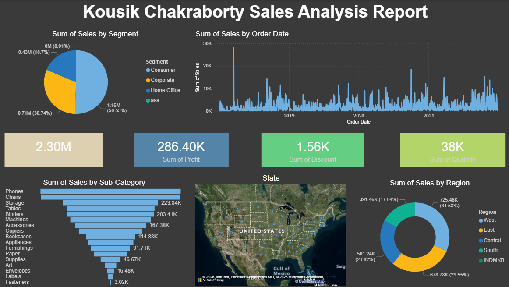

# 📊 Power BI Sales Analysis Dashboard

An interactive Power BI dashboard created to analyze sales performance across different segments, regions, states, and product sub-categories.

## 📌 Dashboard Preview

## 🎯 Objective

The objective of this project is to analyze sales data and identify important trends and patterns in:

- Sales and Profit
- Customer Segments
- Regional Performance
- Product Sub-Categories
- Sales Trends Over Time
- Quantity and Discount

## 📊 Key KPIs

| KPI | Value |
|---|---:|
| Total Sales | 2.30M |
| Total Profit | 286.40K |
| Total Discount | 1.56K |
| Total Quantity | 38K |

## 📈 Dashboard Visualizations

- Sales by Segment
- Sales Trend by Order Date
- Sales by Product Sub-Category
- Sales by Region
- Geographic Sales Distribution
- KPI Cards for Sales, Profit, Discount, and Quantity

## 💡 Key Insights

- The Consumer segment contributes the largest share of total sales.
- The West region has the highest sales contribution among the regions shown.
- Phones generate the highest sales among the product sub-categories.
- The dashboard provides an overview of sales performance across different time periods and geographical locations.

## 🛠️ Tools & Technologies

- Power BI
- Power Query
- DAX
- Microsoft Excel

## 📂 Project Files

- `Dashboard.pbix` – Power BI dashboard file
- `Sai kumar sales data.xlsx` – Dataset used for analysis
- `dashboard.png` – Dashboard preview
- `README.md` – Project documentation

## 🚀 How to Use

1. Download or clone this repository.
2. Open `Dashboard.pbix` using Microsoft Power BI Desktop.
3. Explore the interactive dashboard and apply filters to analyze the data.

## 👤 Author

**Kousik Chakraborty**

B.Tech Data Science | Aspiring Data Analyst
